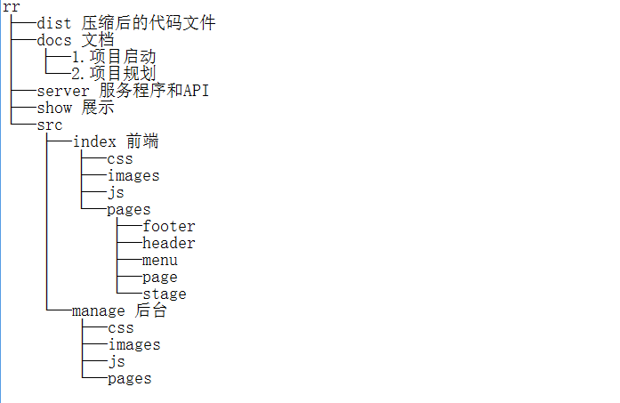
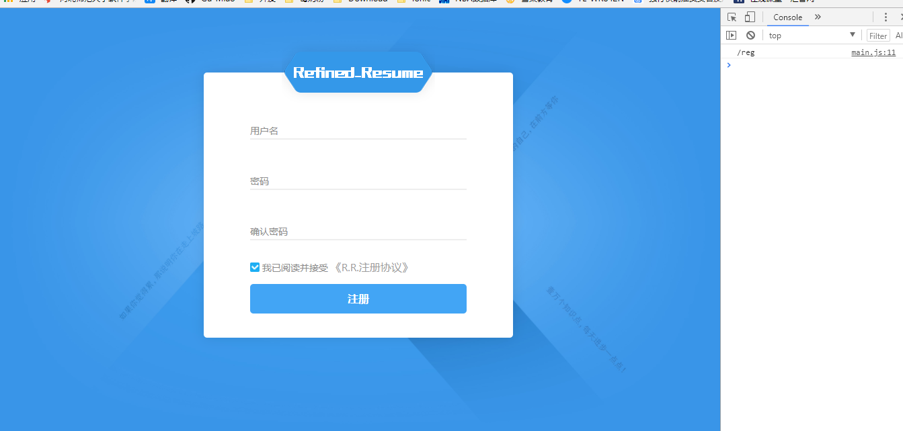
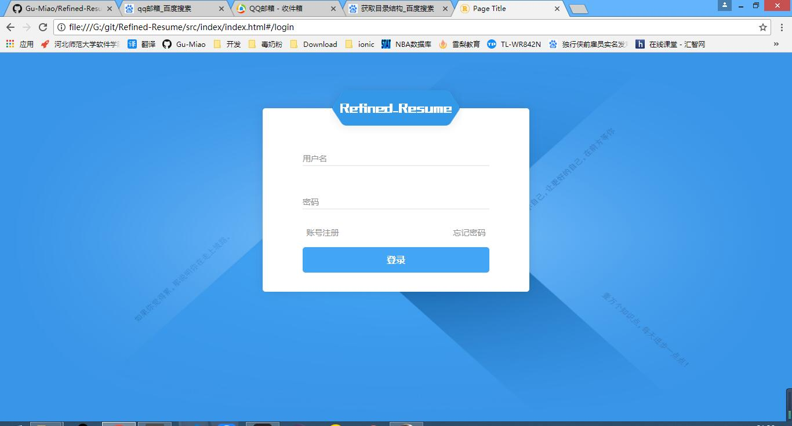
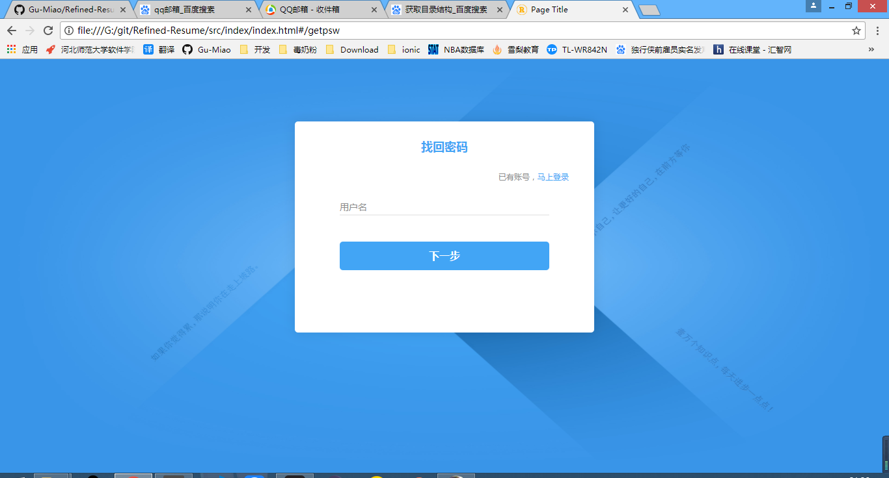
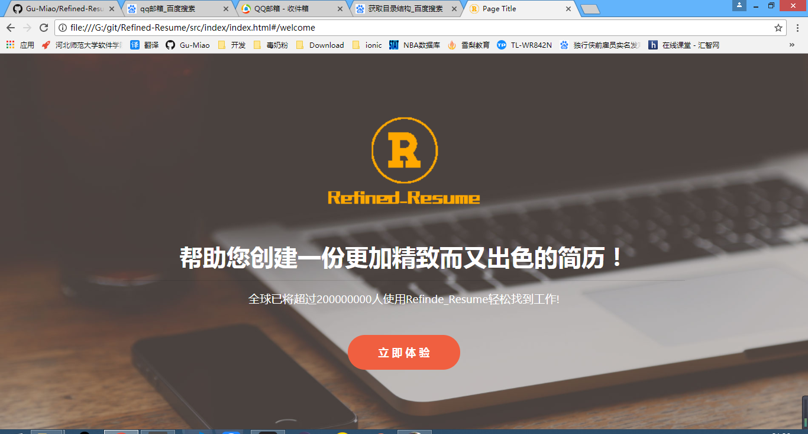
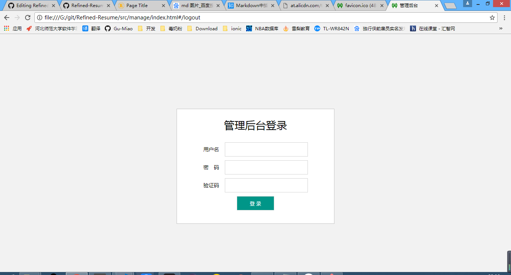
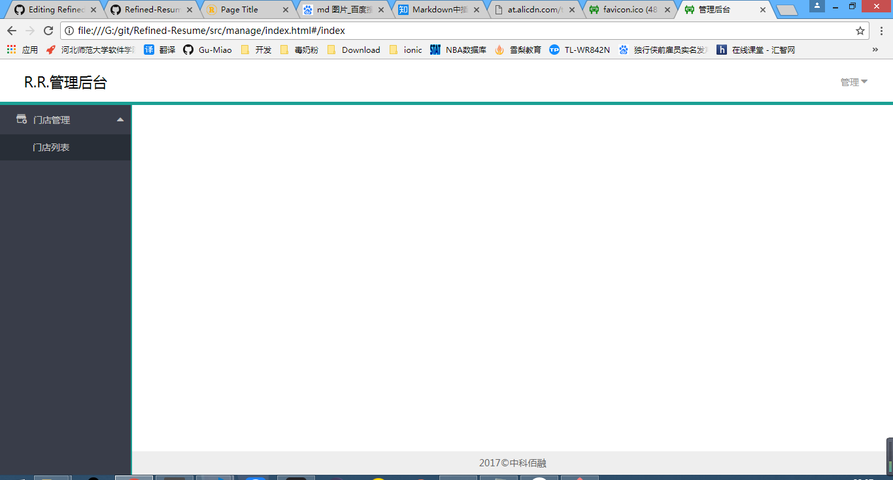

# 第一次展示

## 仓库目录结构



## 前端

* 前端页面入口（index.html）
 ```html
 <!DOCTYPE html>
<html>
<head>
    <meta charset="utf-8" />
    <meta http-equiv="X-UA-Compatible" content="IE=edge">
    <title>Page Title</title>
    <meta name="viewport" content="width=device-width, initial-scale=1">
    <link rel="icon" href="images/favicon.png">
    <link rel="stylesheet" type="text/css" href="css/bootstrap.min.css" />
    <link rel="stylesheet" type="text/css" href="css/main.css" />
    <link rel="stylesheet" type="text/css" href="css/header.css" />
    <link rel="stylesheet" type="text/css" href="css/register.css" />
    <link rel="stylesheet" type="text/css" href="css/login.css" />
    <link rel="stylesheet" type="text/css" href="css/getpsw.css">
    <link rel="stylesheet" type="text/css" href="css/menu.css" />
    <link rel="stylesheet" type="text/css" href="css/footer.css" />
    <link rel="stylesheet" type="text/css" href="css/stage.css" />
    <link rel="stylesheet" type="text/css" href="css/welcome.css" />
</head>
<body>
    <div id="rr"></div>
<script src="js/config.js"></script>
<script src="js/jquery.min.js"></script>
<script src="js/welcome.js"></script>
<script src="js/register.js"></script>
<script src="js/login.js"></script>
<script src="js/getpsw.js"></script>
<script src="js/header.js"></script>
<script src="js/menu.js"></script>
<script src="js/stage.js"></script>
<script src="js/footer.js"></script>
<script src="js/main.js"></script>
</body>
</html>
 ```

 * 注册界面  
 
 * 登录界面  
 
 * 忘记密码界面  
 
 * 欢迎界面  
 
 
 ## 后台页面
 
 * 后天页面入口文件
 ```html
<!DOCTYPE html>
<html lang="en">
<head>
  <meta charset="UTF-8">
  <meta http-equiv="X-UA-Compatible" content="IE=edge,chrome=1">
  <title>管理后台</title>
  <link rel="stylesheet" href="css/font_604203_ud0lq1xob1nvobt9.css">
  <link rel="stylesheet" href="css/normalize.css">
  <link rel="stylesheet" href="css/c-login.css">
  <link rel="stylesheet" href="css/c-header.css">
  <link rel="stylesheet" href="css/c-menu.css">
  <link rel="stylesheet" href="css/c-stage.css">
  <link rel="stylesheet" href="css/c-footer.css">
  <link rel="stylesheet" href="css/p-change-password.css">
  <link rel="stylesheet" href="css/app.css">
  <link rel="icon" href="images/favicon.ico" sizes="48x48" type="image/png">
</head>
<body>
<div id="admin-app">
</div>
<script src="js/jquery.min.js"></script>
<script src="js/config.js"></script>
<script src="js/c-login.js"></script>
<script src="js/c-header.js"></script>
<script src="js/c-menu.js"></script>
<script src="js/c-stage.js"></script>
<script src="js/c-footer.js"></script>
<script src="js/p-store-list.js"></script>
<script src="js/p-change-password.js"></script>
<script src="js/app.js"></script>
</body>
</html>
 ```
 * 登录界面
 
 * 主页
 
 
## 服务程序和API

页面服务 page.js
```js
#!/usr/bin/node

var http = require("http");
var fs = require("fs");

var root = __dirname + "/" + "../src/index";
console.log(root);
var server = http.createServer(function(req, res) {

  var url = "http://" + req.headers.host + req.url;

  console.log("url:", url);
  console.log("headers:", req.headers);
  console.log("");

  var fileName = root + req.url;

  fs.createReadStream(fileName).pipe(res);
}).listen(8080);
```
注册调用的 API reg.js
```js
#!/usr/bin/node

var usernames = [];
var http = require("http");
var MongoClient = require('mongodb').MongoClient;
var url = 'mongodb://localhost:27017/rr'; 

MongoClient.connect(url, function(err, db) {
  console.log("数据库连接成功！");
  selectData(db, function(result) {
    for(let i=0;i<result.length;i++) {
      usernames.push(result[i].username);
    }
    db.close();
    console.log("usernames: ", usernames);
  });
});
  

http.createServer(function(req, res) {
    console.log("req.headers: ", req.headers);
    console.log("req.url: ", req.url);
    console.log("");

    switch(req.method) {
        case "GET":
            get(res);
            break;
        case "POST":
            insert(req, res);
            break;
        default:
            console.log(req);
            break;
    }
}).listen(8000);

function get(res) {
    console.log("GET");
    var body = "hello";
    
    res.setHeader("Content-Length", Buffer.byteLength(body));
    res.setHeader("Content-Type", "text/plain; charset='utf-8'");
    res.setHeader("Access-Control-Allow-Origin", "*");
    res.end(body);

}
function insert(req, res) {
    console.log("POST");
    
    var username = "";
    var password = "";
    var had = false; // 标识符
    var end = "注册成功";

    req.on("data", function(data) {
      username = JSON.parse(data.toString("utf8")).username;
      password = JSON.parse(data.toString("utf8")).password;
      for(let i = 0; i < usernames.length; i++) {
        if(username == usernames[i]) {
          end = "用户名已存在";
          had = true;
          break;
        }
      }

      if(had === false) {
        MongoClient.connect(url, function(err, db) {
          console.log("数据库连接成功！");
          insertData(db, function(result) {
            console.log(result);
            db.close();
          }, username, password);
        });
      }
      
    });

    req.on("end", function() {
      if(had === false) {
        usernames.push(username);
      }
      res.setHeader("Access-Control-Allow-Origin", "*");
      res.setHeader("Content-Type", "text/plain; charset='utf-8'");
      res.setHeader("Content-Length", Buffer.byteLength(end));
      res.end(end);

    });

}

function selectData(db, callback) {  
  var collection = db.collection('user');
  collection.find().toArray(function(err, result) {
    if(err)
    {
      console.log('Error:'+ err);
      return;
    }     
    callback(result);
  });
};

function insertData(db, callback, username, password)  {  
    var collection = db.collection('user');
    var usr = "";
    var psw = "";
    usr += username;
    psw += password;
    var data = [{username: usr, password: psw}];
    collection.insert(data, function(err, result) { 
      if(err) {
        console.log('Error:'+ err);
        return;
      }     
      callback(result);
    });
}

```

* 调用 API 的方法
```js
function reg() { // 注册按钮回调函数
  var usr = document.getElementsByClassName("usr")[0].value;
  var psw = document.getElementsByClassName("psw")[0].value;
  var cpsw = document.getElementsByClassName("psw")[1].value;
  var radio = document.getElementsByClassName("radio")[0];
  var usr_em = document.getElementsByClassName("em")[0];
  var psw_em = document.getElementsByClassName("em")[1];
  var cpsw_em = document.getElementsByClassName("em")[2];

  console.log(usr, psw, cpsw);
  console.log(radio.classList[1]);
  if(usr === "" || usr === "用户名") {
    usr_em.innerHTML = "用户名不能为空";
  } else {
    usr_em.innerHTML = "";
  }
  
  if(psw === "" || psw === "密码") {
    psw_em.innerHTML = "密码不能为空";
  } else if(psw.length < 6) {
    psw_em.innerHTML = "密码长度不得少于6位";
  } else {
    psw_em.innerHTML = "";
  }
  
  if(cpsw !== psw || cpsw === "确认密码") {
    cpsw_em.innerHTML = "请确认密码";
  } else {
    cpsw_em.innerHTML = "";
  }
  
  
  if(usr_em.innerHTML === "" && psw_em.innerHTML === "" && cpsw_em.innerHTML === "" && radio.classList[1]) {
    var data = {username: usr, password: psw};
    console.log("fetching...");
    fetch("http://192.168.42.122:8000", {
      method: "POST",
      body: JSON.stringify(data)
    }).then(function(res) {
      res.text().then(function(data) {
        if(data == "用户名已存在") {
          alert("用户名已存在");
          usr_em.innerHTML = "* 用户名已存在";
        } else {
          alert("注册成功！");
          this.location.hash = "#/login$usr="+usr+"$psw="+psw;
        }
      });
    });
  }

}
```
